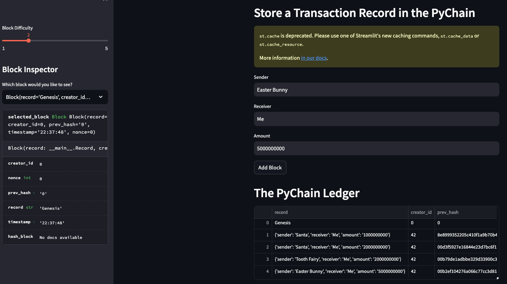
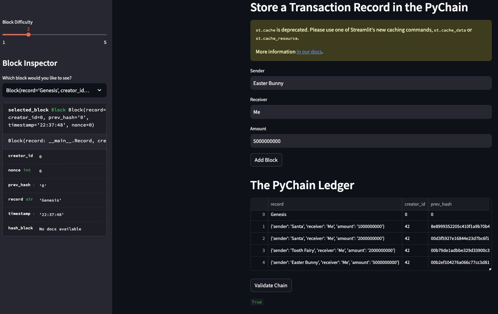
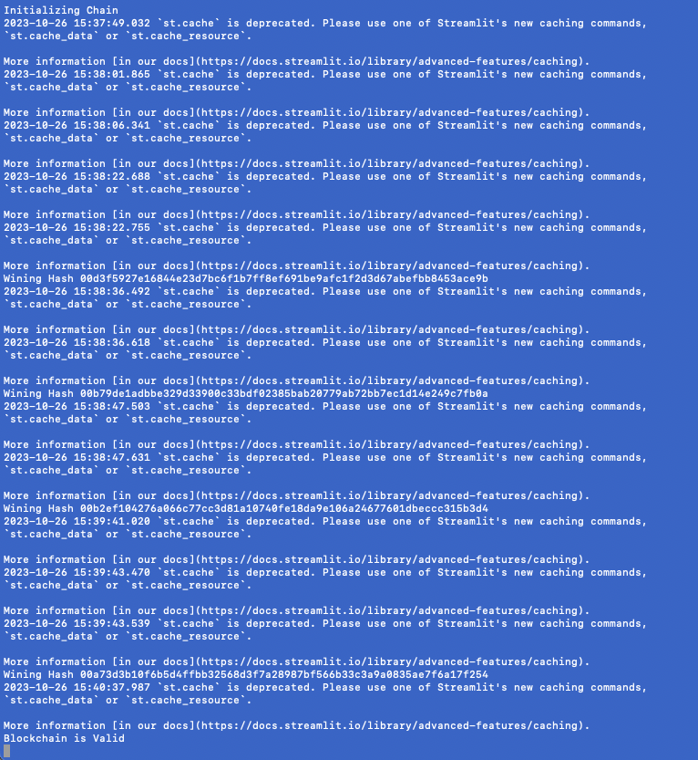

# PyChain #
## Store Transaction Records in the PyChain ##

### Code Base ###
[pychain.py](Starter_Code/pychain.py)

### Block Creation ###

### Chain Validation ###

### Chain Validation (terminal view) ###

